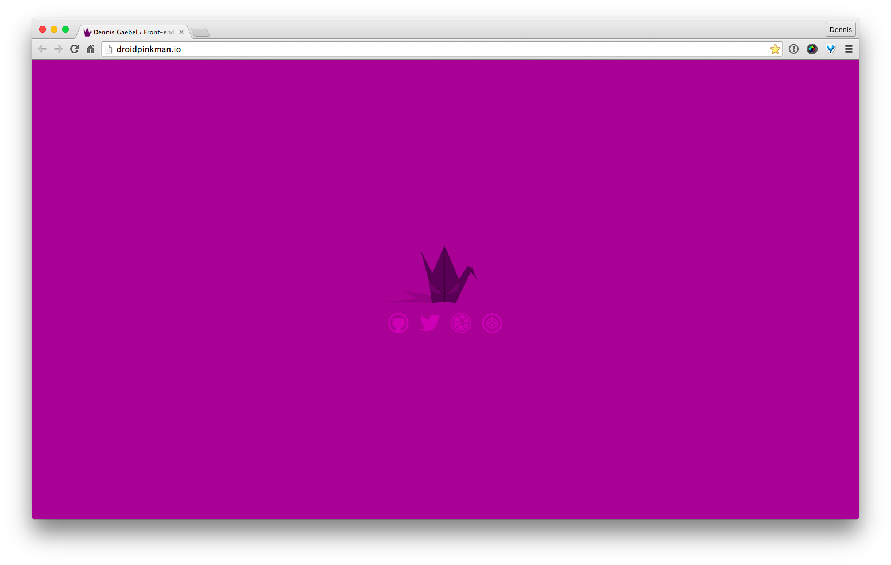

## Project Overview

 - Site Generator : 11ty
 - Template Language : Nunjucks
 - Styles : [Sass](https://www.belter.io/eleventy-sass-workflow)
 - Package Manager : NPM
 - Node v12.18.3
 - Builder : [GitHub Workflows](https://www.rockyourcode.com/how-to-deploy-eleventy-to-github-pages-with-github-actions)

## Installation

```javascript
$ npm install
```

### Serve Templates

```shell
npm start
```

```shell
npm build
```

## Environment Control

Environmental controls are governed by an option found within ``siteConfig.js``. [Docs reference](https://www.11ty.dev/docs/data-js/#example-exposing-environment-variables)

```shell
ELEVENTY_ENV=development npx @11ty/eleventy --serve
```

```shell
ELEVENTY_ENV=production npx @11ty/eleventy
```

```nunjucks

<style>{{ css | cssmin | safe }}</style>

<style>{{ css | safe }}</style>

```